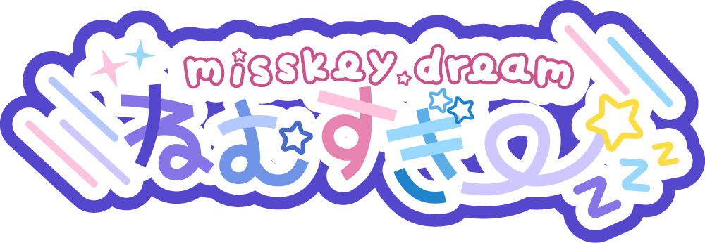

このレポジトリはMisskeyサーバーである「[ねむすぎー](https://misskey.secinet.jp)」で使用している本家Misskeyからのフォークです。

**🌎 **Misskey** is an open source, federated social media platform that's free forever! 🚀**

[Learn more](https://misskey-hub.net/)

---

## ねむすぎー (dream)

こちらのフォークは様々な変更を加えています。フォークの変更履歴を見たい方は[こちら](https://misskey.secinet.jp/dream-changelog)にアクセスすることで変更履歴を閲覧することができます。

アイコンの使用ガイドラインなどは[こちら](./packages/backend/assets/README.md)をご参照ください。

その他独自リソースについて、ねむすぎー外での使用を許可していません。あらかじめご了承ください。

独自実装された機能を使用する場合は管理者までご連絡ください。(つまり、物によっては導入に問題が生じる実装が存在するということです。)
